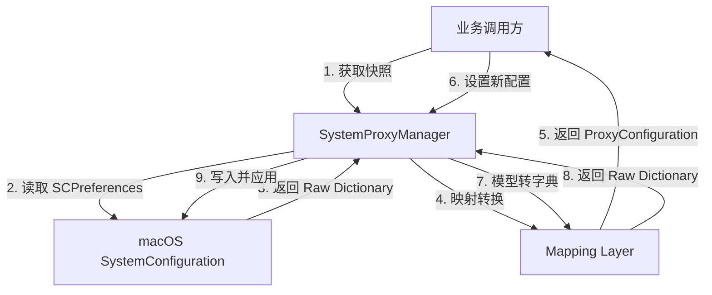

# SystemProxyKit 技术设计文档

**版本:** v1.0.0  
**状态:** 待开发 (Draft)  
**目标平台:** macOS 10.15+  
**核心依赖:** `SystemConfiguration.framework`

---

## 1. 项目概述 (Overview)

`SystemProxyKit` 是一个专为 macOS 设计的 Swift Package，旨在提供一套类型安全、符合 Swift 语言习惯的 API，用于管理和修改系统网络代理设置。

**核心价值：**

1. **封装复杂性：** 屏蔽 `SystemConfiguration` 繁琐的 C 指针操作和字典映射。
2. **快照与回滚：** 提供“读取-修改-恢复”的事务性操作能力，防止误操作导致用户网络中断。
3. **精细化控制：** 支持 HTTP, HTTPS, SOCKS, PAC 自动配置及忽略列表的独立设置。

---

## 2. 项目架构 (Architecture)

采用 **领域驱动设计 (DDD)** 思想，将数据模型、映射逻辑与系统交互逻辑分层。

### 2.1 文件目录结构

```text
SystemProxyKit/
├── Package.swift
├── Sources/
│   └── SystemProxyKit/
│       ├── Models/                # [数据层] 纯 Swift 结构体，无任何 SC 依赖
│       │   ├── ProxyConfiguration.swift
│       │   ├── ProxyServer.swift
│       │   ├── PACConfiguration.swift
│       │   ├── BatchProxyResult.swift
│       │   └── RetryPolicy.swift
│       ├── Mapping/               # [转换层] 负责 Swift Model <-> SC Dictionary 互转
│       │   └── ProxyConfiguration+SC.swift
│       ├── Core/                  # [逻辑层] 核心业务与系统交互
│       │   ├── SystemProxyManager.swift
│       │   └── NetworkServiceHelper.swift
│       ├── Utils/                 # [工具层] 错误定义与常量
│       │   ├── SystemProxyError.swift
│       │   └── SCConstants.swift
│       └── SystemProxyKit.swift   # [接口层] 库的统一入口
└── Tests/
    └── SystemProxyKitTests/
        └── SystemProxyKitTests.swift
```

### 2.2 数据流向图



-----

## 3\. 数据模型设计 (Data Models)

数据层是纯净的 Swift Struct，不包含任何 SystemConfiguration 的引用，便于上层 UI 绑定和测试。

> **线程安全：** 所有数据模型均遵循 `Sendable` 协议，确保在 Swift Concurrency 环境下安全传递。

### 3.1 `ProxyServer`

描述单个代理服务器节点，支持可选的认证信息。

| 属性 | 类型 | 说明 |
| :--- | :--- | :--- |
| `host` | `String` | 主机名或 IP 地址 |
| `port` | `Int` | 端口号 |
| `isEnabled` | `Bool` | 开关状态 |
| `username` | `String?` | 认证用户名（可选） |
| `password` | `String?` | 认证密码（可选，建议使用 Keychain 安全存储） |

> **安全提示：** 密码字段在序列化时需特别注意，建议通过 `Security.framework` 存入 Keychain，仅保存引用。

### 3.2 `PACConfiguration`

描述 PAC (Proxy Auto-Configuration) 自动代理配置，独立于 `ProxyServer`。

| 属性 | 类型 | 说明 |
| :--- | :--- | :--- |
| `url` | `URL` | PAC 脚本的 URL 地址 |
| `isEnabled` | `Bool` | 开关状态 |

### 3.3 `ProxyConfiguration`

描述完整的网络服务代理配置（对应系统偏好设置 UI）。

| 属性 | 类型 | 说明 |
| :--- | :--- | :--- |
| **Automatic** | | |
| `autoDiscoveryEnabled` | `Bool` | 自动发现代理 (WPAD) |
| `autoConfigURL` | `PACConfiguration?` | 自动代理配置 (PAC) |
| **Manual** | | |
| `httpProxy` | `ProxyServer?` | 网页代理 (HTTP) |
| `httpsProxy` | `ProxyServer?` | 安全网页代理 (HTTPS) |
| `socksProxy` | `ProxyServer?` | SOCKS 代理 |
| **Exceptions** | | |
| `excludeSimpleHostnames`| `Bool` | 不包括简单主机名 |
| `exceptionList` | `[String]` | 忽略的主机与域列表 |

> **设计决策：**
> - `ProxyConfiguration` 必须遵循 `Equatable` 和 `Sendable` 协议。
> - 本库**不支持** FTP 代理和 RTSP 流式代理（使用场景极少，已逐渐废弃）。

### 3.4 `RetryPolicy`

描述操作失败时的重试策略，供调用方自定义。

| 属性 | 类型 | 说明 |
| :--- | :--- | :--- |
| `maxRetries` | `Int` | 最大重试次数（默认 0） |
| `delay` | `TimeInterval` | 重试间隔（秒，默认 0） |
| `backoffMultiplier` | `Double` | 退避倍数（默认 1.0） |

```swift
// 预设策略
static let none = RetryPolicy(maxRetries: 0, delay: 0, backoffMultiplier: 1.0)
static let `default` = RetryPolicy.none  // 默认：不重试
static let standard = RetryPolicy(maxRetries: 3, delay: 0.5, backoffMultiplier: 2.0)
static let aggressive = RetryPolicy(maxRetries: 5, delay: 0.2, backoffMultiplier: 1.5)
```

### 3.5 `BatchProxyResult`

批量代理配置操作的结果。

| 属性 | 类型 | 说明 |
| :--- | :--- | :--- |
| `succeeded` | `[String]` | 成功配置的服务列表 |
| `failed` | `[(service: String, error: Error)]` | 失败的服务及错误 |
| `allSucceeded` | `Bool` | 是否全部成功 |
| `successCount` | `Int` | 成功操作数 |
| `failureCount` | `Int` | 失败操作数 |

-----

## 4\. 映射层设计 (Mapping Layer)

**文件：** `Mapping/ProxyConfiguration+SC.swift`

此层负责脏活累活，解决“Swift 强类型”与“C 弱类型字典”之间的阻抗匹配。

### 功能点

1.  **Serialization (Model -\> Dict):** 将 `ProxyConfiguration` 转换为 `[String: Any]`，用于 `SCNetworkProtocolSetConfiguration`。
      * *细节：* 必须处理 `0/1` 与 `Bool` 的转换，以及处理空值（nil）。
2.  **Deserialization (Dict -\> Model):** 将 `SCNetworkProtocolGetConfiguration` 返回的字典转换为 `ProxyConfiguration`。
      * *细节：* 必须防御性编程，处理字段缺失的情况，提供默认值。

-----

## 5\. 核心逻辑设计 (Core Logic)

> **并发模型：** 核心控制器使用 Swift Concurrency (`async/await`) 实现，所有公开 API 均为 `async throws`。

### 5.1 `NetworkServiceHelper`

**职责：** 屏蔽 `SCNetworkService` 的查找细节。遵循 `Sendable` 协议。

  * **API:** `func findService(byName: String, in: SCPreferences) -> SCNetworkService?`
  * **逻辑：** 遍历系统所有服务，对比 `SCNetworkServiceGetName`。
  * **扩展性：** 未来可扩展为通过 BSD Name (如 `en0`) 查找。

### 5.2 `SystemProxyManager` (核心控制器)

**职责：** 事务管理、权限上下文持有、API 暴露。

**线程安全：** 使用 `actor` 或内部串行队列确保并发安全，遵循 `Sendable` 约束。

#### 关键方法设计

**1. 获取当前配置 (快照)**

```swift
func getConfiguration(for interface: String) async throws -> ProxyConfiguration
```

  * **步骤：**
    1.  创建临时只读 `SCPreferences` 会话。
    2.  调用 Helper 找到目标服务。
    3.  获取 Protocol Configuration 字典。
    4.  调用 Mapping 层生成模型。
    5.  **不** 执行 Lock 操作（读取无需锁）。

**2. 应用配置 (覆盖)**

```swift
func setProxy(
    for interface: String,
    configuration: ProxyConfiguration,
    authRef: AuthorizationRef? = nil,
    retryPolicy: RetryPolicy = .default
) async throws
```

  * **前置条件：** 进程必须拥有 Root 权限 或 提供了有效的 `authRef`。
  * **步骤：**
    1.  `SCPreferencesCreateWithAuthorization` 创建会话。
    2.  `SCPreferencesLock` **(关键点：必须锁定)**。
       - 若锁定失败，根据 `retryPolicy` 进行重试（支持指数退避）。
    3.  获取服务与 Protocol。
    4.  调用 Mapping 层生成字典。
    5.  `SCNetworkProtocolSetConfiguration` 写入内存。
    6.  `SCPreferencesCommitChanges` 提交到数据库。
    7.  `SCPreferencesApplyChanges` 通知系统生效。
    8.  `SCPreferencesUnlock` 解锁。

**3. 便捷静态方法**

```swift
// 获取代理配置（单个或批量）
static func getProxy(for interface: String) async throws -> ProxyConfiguration
static func getProxy(for interfaces: [String]) async throws -> [(interface: String, config: ProxyConfiguration)]

// 设置代理（单个或批量）
static func setProxy(_ config: ProxyConfiguration, for interface: String) async throws
static func setProxy(_ config: ProxyConfiguration, for interfaces: [String]) async throws -> BatchProxyResult
static func setProxy(configurations: [(interface: String, config: ProxyConfiguration)]) async throws -> BatchProxyResult
static func setProxyForAllEnabledServices(_ config: ProxyConfiguration) async throws -> BatchProxyResult
```

> **批量操作：** 批量方法通过单次 `SCPreferencesCommitChanges` 和 `SCPreferencesApplyChanges` 调用来优化性能。

-----

## 6\. 错误处理设计 (Error Handling)

使用 Swift `Error` 枚举 `SystemProxyError` 统一抛出异常。

| 错误枚举 | 触发场景 | 建议处理 |
| :--- | :--- | :--- |
| `preferencesCreationFailed` | 系统资源不足或权限严重拒绝 | 检查 App 签名或权限 |
| `lockFailed` | 其他进程正在修改网络设置 | 稍后重试 |
| `serviceNotFound(name)` | 用户输入的网卡名错误 (如 "Wi-Fi 2") | 提示用户检查网卡名称 |
| `commitFailed` | 写入系统数据库失败 | 检查是否有 Root 权限 |
| `applyFailed` | 配置写入成功但无法生效 | 提示用户重启网络服务 |

-----

## 7\. 业务流程示例 (Business Workflow)

这是业务方使用此库时的标准 **"安全修改模式"**：

```swift
import SystemProxyKit

// 1. 备份当前配置
let originalConfig = try await SystemProxyKit.getProxy(for: "Wi-Fi")

// 2. 创建新配置
let newProxy = ProxyServer(
    host: "127.0.0.1",
    port: 7890,
    isEnabled: true,
    username: nil,
    password: nil
)
var newConfig = originalConfig
newConfig.httpProxy = newProxy
newConfig.httpsProxy = newProxy

// 3. 应用配置（带自定义重试策略）
try await SystemProxyKit.setProxy(
    newConfig,
    for: "Wi-Fi",
    retryPolicy: .default
)

// 4. 恢复原始配置（当业务结束时）
try await SystemProxyKit.setProxy(originalConfig, for: "Wi-Fi")
```

### PAC 配置示例

```swift
var config = try await SystemProxyKit.getProxy(for: "Wi-Fi")
config.autoConfigURL = PACConfiguration(
    url: URL(string: "http://example.com/proxy.pac")!,
    isEnabled: true
)
try await SystemProxyKit.setProxy(config, for: "Wi-Fi")
```

-----

## 8\. 待办事项与风险 (TODO & Risks)

1.  ~~**多网卡并发：** 目前设计是针对单网卡。~~ **已解决：** 批量 API 现已支持多网卡，通过单次 commit/apply 优化性能。
2.  **权限上下文：** 虽然库不负责实现 XPC，但 API 设计中预留了 `authRef` 入口，确保未来接入 `Security.framework` 时无需破坏性重构 API。
3.  **IPv6 支持：** 确认 `SystemConfiguration` 中对于 IPv6 字面量地址的解析是否存在坑（通常由系统底层处理，但需留意）。
4.  **Keychain 集成：** 代理认证密码的安全存储需要后续版本集成 Keychain 服务，当前版本暂时使用内存存储。

---

## 9\. 协议遵循清单 (Protocol Conformance)

| 类型 | 遵循的协议 |
| :--- | :--- |
| `ProxyServer` | `Equatable`, `Hashable`, `Sendable`, `Codable` |
| `PACConfiguration` | `Equatable`, `Hashable`, `Sendable`, `Codable` |
| `ProxyConfiguration` | `Equatable`, `Sendable`, `Codable` |
| `BatchProxyResult` | `Sendable` |
| `RetryPolicy` | `Equatable`, `Sendable` |
| `SystemProxyError` | `Error`, `Sendable` |
| `SystemProxyManager` | `Sendable` (通过 `actor` 实现) |
