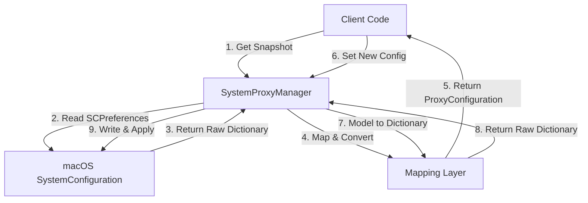

# SystemProxyKit Technical Design Document

**Version:** v1.0.0  
**Status:** Implemented  
**Target Platform:** macOS 10.15+  
**Core Dependencies:** `SystemConfiguration.framework`

---

## 1. Project Overview

`SystemProxyKit` is a Swift Package designed specifically for macOS, providing a type-safe, idiomatic Swift API for managing and modifying system network proxy settings.

**Core Value:**

1. **Encapsulate Complexity:** Abstract away the tedious C pointer operations and dictionary mappings of `SystemConfiguration`.
2. **Snapshot & Rollback:** Provide transactional "read-modify-restore" capabilities to prevent network disruption from misconfigurations.
3. **Fine-Grained Control:** Support independent configuration of HTTP, HTTPS, SOCKS, PAC auto-configuration, and exception lists.

---

## 2. Project Architecture

Adopts **Domain-Driven Design (DDD)** principles, separating data models, mapping logic, and system interaction logic into distinct layers.

### 2.1 Directory Structure

```text
SystemProxyKit/
├── Package.swift
├── Sources/
│   └── SystemProxyKit/
│       ├── Models/                # [Data Layer] Pure Swift structs, no SC dependencies
│       │   ├── ProxyConfiguration.swift
│       │   ├── ProxyServer.swift
│       │   ├── PACConfiguration.swift
│       │   ├── BatchProxyResult.swift
│       │   └── RetryPolicy.swift
│       ├── Mapping/               # [Conversion Layer] Swift Model <-> SC Dictionary conversion
│       │   └── ProxyConfiguration+SC.swift
│       ├── Core/                  # [Logic Layer] Core business and system interaction
│       │   ├── SystemProxyManager.swift
│       │   └── NetworkServiceHelper.swift
│       ├── Utils/                 # [Utility Layer] Error definitions and constants
│       │   ├── SystemProxyError.swift
│       │   └── SCConstants.swift
│       └── SystemProxyKit.swift   # [Interface Layer] Unified library entry point
└── Tests/
    └── SystemProxyKitTests/
        ├── SystemProxyKitTests.swift
        ├── IntegrationTests.swift
        └── PrivilegedIntegrationTests.swift
```

### 2.2 Data Flow Diagram



-----

## 3. Data Model Design

The data layer consists of pure Swift structs with no `SystemConfiguration` references, making them ideal for UI binding and testing.

> **Thread Safety:** All data models conform to `Sendable` protocol, ensuring safe use in Swift Concurrency environments.

### 3.1 `ProxyServer`

Represents a single proxy server node with optional authentication.

| Property | Type | Description |
| :--- | :--- | :--- |
| `host` | `String` | Hostname or IP address |
| `port` | `Int` | Port number |
| `isEnabled` | `Bool` | Enable/disable state |
| `username` | `String?` | Authentication username (optional) |
| `password` | `String?` | Authentication password (optional, should use Keychain for secure storage) |

> **Security Note:** The password field requires special care when serializing. It's recommended to store credentials in Keychain via `Security.framework` and only keep references.

### 3.2 `PACConfiguration`

Represents PAC (Proxy Auto-Configuration) settings, independent of `ProxyServer`.

| Property | Type | Description |
| :--- | :--- | :--- |
| `url` | `URL` | URL of the PAC script |
| `isEnabled` | `Bool` | Enable/disable state |

### 3.3 `ProxyConfiguration`

Complete network service proxy configuration (corresponding to System Preferences UI).

| Property | Type | Description |
| :--- | :--- | :--- |
| **Automatic** | | |
| `autoDiscoveryEnabled` | `Bool` | Auto-discover proxy (WPAD) |
| `autoConfigURL` | `PACConfiguration?` | Auto proxy configuration (PAC) |
| **Manual** | | |
| `httpProxy` | `ProxyServer?` | Web proxy (HTTP) |
| `httpsProxy` | `ProxyServer?` | Secure web proxy (HTTPS) |
| `socksProxy` | `ProxyServer?` | SOCKS proxy |
| **Exceptions** | | |
| `excludeSimpleHostnames`| `Bool` | Exclude simple hostnames |
| `exceptionList` | `[String]` | Bypass proxy for these hosts and domains |

> **Design Decision:**
> - `ProxyConfiguration` must conform to `Equatable` and `Sendable` protocols.
> - This library **does not support** FTP proxy and RTSP streaming proxy (rarely used, gradually deprecated).

### 3.4 `RetryPolicy`

Defines retry strategy for failed operations, customizable by callers.

| Property | Type | Description |
| :--- | :--- | :--- |
| `maxRetries` | `Int` | Maximum retry attempts (default: 0) |
| `delay` | `TimeInterval` | Retry interval in seconds (default: 0) |
| `backoffMultiplier` | `Double` | Backoff multiplier (default: 1.0) |

```swift
// Preset policies
static let none = RetryPolicy(maxRetries: 0, delay: 0, backoffMultiplier: 1.0)
static let `default` = RetryPolicy.none  // Default: no retry
static let standard = RetryPolicy(maxRetries: 3, delay: 0.5, backoffMultiplier: 2.0)
static let aggressive = RetryPolicy(maxRetries: 5, delay: 0.2, backoffMultiplier: 1.5)
```

### 3.5 `BatchProxyResult`

Result of batch proxy configuration operations.

| Property | Type | Description |
| :--- | :--- | :--- |
| `succeeded` | `[String]` | Successfully configured services |
| `failed` | `[(service: String, error: Error)]` | Failed services with errors |
| `allSucceeded` | `Bool` | Whether all operations succeeded |
| `successCount` | `Int` | Number of successful operations |
| `failureCount` | `Int` | Number of failed operations |

-----

## 4. Mapping Layer Design

**File:** `Mapping/ProxyConfiguration+SC.swift`

This layer handles the impedance mismatch between "Swift strong typing" and "C weak-typed dictionaries".

### Capabilities

1. **Serialization (Model -> Dict):** Converts `ProxyConfiguration` to `[String: Any]` for `SCNetworkProtocolSetConfiguration`.
   * *Details:* Must handle `0/1` to `Bool` conversion and nil values.
2. **Deserialization (Dict -> Model):** Converts dictionaries returned by `SCNetworkProtocolGetConfiguration` to `ProxyConfiguration`.
   * *Details:* Requires defensive programming to handle missing fields with default values.

-----

## 5. Core Logic Design

> **Concurrency Model:** Core controller uses Swift Concurrency (`async/await`). All public APIs are `async throws`.

### 5.1 `NetworkServiceHelper`

**Responsibility:** Abstract away `SCNetworkService` lookup details. Conforms to `Sendable`.

* **API:** `func findService(byName: String, in: SCPreferences) -> SCNetworkService?`
* **Logic:** Iterates through all system services, comparing `SCNetworkServiceGetName`.
* **Extensibility:** Can be extended to support lookup by BSD name (e.g., `en0`).

### 5.2 `SystemProxyManager` (Core Controller)

**Responsibility:** Transaction management, authorization context holding, API exposure.

**Thread Safety:** Implemented as an `actor` to ensure concurrent safety, conforming to `Sendable`.

#### Key Method Design

**1. Get Current Configuration (Snapshot)**

```swift
func getConfiguration(for interface: String) async throws -> ProxyConfiguration
```

* **Steps:**
  1. Create temporary read-only `SCPreferences` session.
  2. Use Helper to find target service.
  3. Get Protocol Configuration dictionary.
  4. Call Mapping layer to generate model.
  5. **No** Lock operation needed (read-only access).

**2. Apply Configuration (Override)**

```swift
func setProxy(
    for interface: String,
    configuration: ProxyConfiguration,
    authRef: AuthorizationRef? = nil,
    retryPolicy: RetryPolicy = .default
) async throws
```

* **Precondition:** Process must have Root privileges or provide valid `authRef`.
* **Steps:**
  1. `SCPreferencesCreateWithAuthorization` to create session.
  2. `SCPreferencesLock` **(critical: must lock)**.
     - If lock fails, retry according to `retryPolicy` (with exponential backoff).
  3. Get service and Protocol.
  4. Call Mapping layer to generate dictionary.
  5. `SCNetworkProtocolSetConfiguration` to write to memory.
  6. `SCPreferencesCommitChanges` to persist to database.
  7. `SCPreferencesApplyChanges` to notify system.
  8. `SCPreferencesUnlock` to release lock.

**3. Convenience Static Methods**

```swift
// Get proxy configuration (single or batch)
static func getProxy(for interface: String) async throws -> ProxyConfiguration
static func getProxy(for interfaces: [String]) async throws -> [(interface: String, config: ProxyConfiguration)]

// Set proxy (single or batch)
static func setProxy(_ config: ProxyConfiguration, for interface: String) async throws
static func setProxy(_ config: ProxyConfiguration, for interfaces: [String]) async throws -> BatchProxyResult
static func setProxy(_ config: ProxyConfiguration, for interfaceFilter: (ServiceInfo) -> Bool) async throws -> BatchProxyResult
static func setProxy(configurations: [(interface: String, config: ProxyConfiguration)]) async throws -> BatchProxyResult
```

> **Batch Operations:** Batch methods optimize performance by using a single `SCPreferencesCommitChanges` and `SCPreferencesApplyChanges` call for multiple services.

-----

## 6. Error Handling Design

Uses Swift `Error` enum `SystemProxyError` for unified exception throwing.

| Error Enum | Trigger Scenario | Suggested Handling |
| :--- | :--- | :--- |
| `preferencesCreationFailed` | System resource shortage or severe permission denial | Check app signature or permissions |
| `lockFailed` | Another process is modifying network settings | Retry later |
| `serviceNotFound(name)` | User-provided interface name is incorrect | Prompt user to check interface name |
| `commitFailed` | Failed to write to system database | Check for root permissions |
| `applyFailed` | Configuration written but failed to take effect | Suggest user restart network services |

-----

## 7. Business Workflow Example

Standard **"Safe Modification Pattern"** for clients using this library:

```swift
import SystemProxyKit

// 1. Backup current configuration
let originalConfig = try await SystemProxyKit.getProxy(for: "Wi-Fi")

// 2. Create new configuration
let newProxy = ProxyServer(
    host: "127.0.0.1",
    port: 7890,
    isEnabled: true,
    username: nil,
    password: nil
)
var newConfig = originalConfig
newConfig.httpProxy = newProxy
newConfig.httpsProxy = newProxy

// 3. Apply configuration (with custom retry policy)
try await SystemProxyKit.setProxy(
    newConfig,
    for: "Wi-Fi",
    retryPolicy: .default
)

// 4. Restore original configuration (when business completes)
try await SystemProxyKit.setProxy(originalConfig, for: "Wi-Fi")
```

### PAC Configuration Example

```swift
var config = try await SystemProxyKit.getProxy(for: "Wi-Fi")
config.autoConfigURL = PACConfiguration(
    url: URL(string: "http://example.com/proxy.pac")!,
    isEnabled: true
)
try await SystemProxyKit.setProxy(config, for: "Wi-Fi")
```

-----

## 8. TODO & Risks

1. ~~**Multi-Interface Concurrency:** Current design targets single interface.~~ **RESOLVED:** Batch APIs now support multiple interfaces with optimized single commit/apply.
2. **Authorization Context:** While the library doesn't implement XPC, the API design reserves an `authRef` entry point to ensure non-breaking API integration with `Security.framework` in the future.
3. **IPv6 Support:** Verify that `SystemConfiguration` properly handles IPv6 literal addresses (typically handled by system layer, but worth attention).
4. **Keychain Integration:** Secure storage of proxy authentication passwords requires Keychain integration in future versions; current version uses in-memory storage.

---

## 9. Protocol Conformance Checklist

| Type | Conforms To |
| :--- | :--- |
| `ProxyServer` | `Equatable`, `Hashable`, `Sendable`, `Codable` |
| `PACConfiguration` | `Equatable`, `Hashable`, `Sendable`, `Codable` |
| `ProxyConfiguration` | `Equatable`, `Sendable`, `Codable` |
| `BatchProxyResult` | `Sendable` |
| `RetryPolicy` | `Equatable`, `Sendable` |
| `SystemProxyError` | `Error`, `Sendable` |
| `SystemProxyManager` | `Sendable` (via `actor`) |
